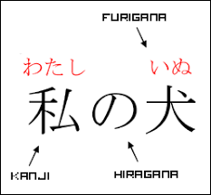
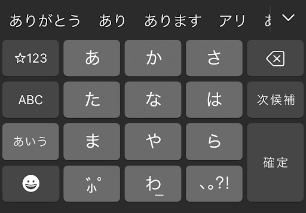

# Week 1 - Hiragana (ひらがな)

One of the first things you will hear about Japanese is the 3 different systems of writing: Hiragana, Katakana, and Kanji characters. You will also hear about Romaji, the romanization system for [Japanese](https://en.wikipedia.org/wiki/Romanization_of_Japanese). We will be focusing on ひらがな; the most common phonetic lettering system.

# Exercises

**Exercise 1 - Write and type ひらがな**: Kana will be split into sets; try to do 1-2 each day. Each set will introduce 10 new kana, and then use them in words. Do not try to "complete" the word list, as it is long and will repeat forever.

**Exercise 2 - Noun Flashcards**: Start word recognition!

# Why focus on ひらがな?

ひらがな is the most common way to describe the phonetics of words in Japanese. Aside from it being used in general language, some other examples of ひらがな being used in common places are:

|                                                                                                                                      |                                                                               |
| :-----------------------------------------------------------------------------------------------------------------------------------------------------------------------------------: | :----------------------------------------------------------------------------------------------------------------------: |
| [Furigana](https://en.wikipedia.org/wiki/Furigana) is commonly used as a [Kanji](https://en.wikipedia.org/wiki/Kanji) pronunciation aid. Furigana typically uses ひらがな characters. | When typing on your phone, you will typically type ひらがな, and then convert it to Katakana or Kanji (like autocorrect) |

# What about Katakana, Kanji, and Romaji?

**Katakana** - Katakana represents that a word is a borrowed foreign word. So for an English speaker, it's tempting to jump into Katakana first, because you can often understand words that you sound out. I don't have anything particularly against doing that. However, since the sounds are entirely the same, I think it gets confusing to learn ひらがな and katakana at the same time. For this reason, we will intentionally try to avoid katakana until we are comfortable with ひらがな.

**Kanji** - We will slowly be learning kanji as we expand our vocabulary. We won't be ignoring kanji. We just won't be focusing on it.

**Romaji** - In this course, we will little to no romaji to prevent it from becoming a crutch. For pronunciation, we should primarly rely on ひらがな. Even for learning ひらがな, we will try to lean on audio as much as we can, instead of Romaji.

# Why Practice Writing?

When I first started wrigin kana, I noticed small differences in the characters much better. For instance, before I started writing, I thought that あ and お were mostly the same character, but with an additional "\`". Only after writing did I notice that the body of the character was different as well.
